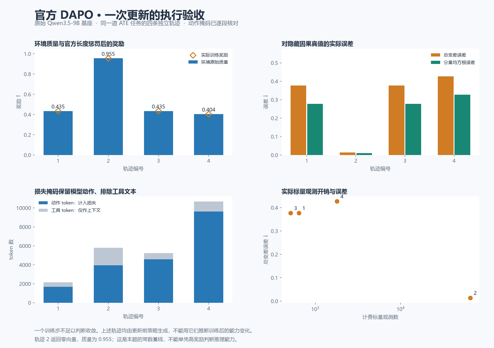

# 官方 DAPO 实际更新验收：2026-09-07

修复后的 `run-02-mask-v1-audit-only` 完成一次真实官方 DAPO 更新并通过下面列出的
实际张量检查。生产长训练继续停止。这次通过仅覆盖当前模型、配置、已核对任务和
实际执行路径，不证明整个任务分布已校准，也不证明训练后能力提高。

## 修复与来源

固定官方 recipe 的 `compute_kl_related_metrics` 原来无条件将工具循环的
`response_mask` 覆盖为 attention mask。失败的 run-01 实际有 11,437 个动作 token，
却按 14,413 个 token 训练，其中 2,976 个来自工具文本。局部公式与错误输入相符
不能证明训练正确；此前只核对局部公式的临时通过文件已撤销。

`patches/verl-recipe-action-mask-v1.patch` 使用固定官方 RayPPOTrainer 已有的 guard：
仅在没有 `response_mask` 时才生成回退掩码。此前的终止协议补丁继续生效。
两个补丁均有显式文件清单、原始与修改后哈希，recipe 补丁另外由 verifier 固定哈希。
训练入口仍是官方 `dapo.main_dapo`；GRPO、动态筛选、非对称裁剪、token 聚合、
Token-TIS 和优化器仍由上游实现。整个 recipe 文件不能称为逐字未修改。

## 实际验收

原始 Qwen3.5-9B 基座，全新 LoRA，未载入或恢复任何旧检查点。
训练集 20 道标签在本轮内核上重新核对；本次真实更新实际使用一组同题四条轨迹。

| 路径 | 实际证据 |
| --- | --- |
| 环境→训练奖励 | 四条真实完成轨迹的质量逐条对应筛选输入；工具步奖励为零；每条质量只在 token 分数中出现一次。本组长度惩罚均为零。 |
| 终止与掩码 | 44 次生成/工具转换；终止动作保留，不追加终止反馈或后续模型生成。按完整 response IDs 对齐 rollout→筛选前 batch→actor，再用完整旧 log-prob 行唯一定位每个 loss microbatch，验证 mask、优势与重要性权重一致且每行恰好使用一次。 |
| 分母 | 19,830 个动作 token；4,018 个工具 token 不计入优势/损失；四个 microbatch 均使用同一全局动作 token 分母。 |
| 筛选与优势 | 一组生成、一组保留、零组丢弃；同一组使用相同世界/tape；真实质量标准差非零；官方标准化优势与解析结果一致。本次运行没有覆盖丢弃分支，相关证据仍来自前次实际运行和标准函数检查。 |
| Token-TIS | 权重均值 1.000073，触及上界 2 的比例为零，有效样本量 19,812.32 / 19,830；动作上最大绝对 log-prob 差异 2.8214。精度后端无需逐位相同。实际脱离梯度的语义由上游源码与另行函数测试核对，不能由观察器的 detached 副本推断。 |
| loss | 四个实际 microbatch 的损失与解析式一致，最大绝对差约 1.14e-8；更新前 current/old actor log-prob 在本次所选 token 上一致。 |
| 梯度→参数 | 496 个 LoRA 张量梯度有限；760 个冻结张量无梯度。初始 B 全零，248 个 B 张量改变；初始 A 梯度为零符合 LoRA 的零 B 初始化。仅一次 Adam 状态更新，裁剪前梯度范数 0.21484375；首步矩与参数更新和解析式一致，最大误差为 1.649 个记录的 dtype 舍入尺度以内。 |

原始模型的冻结参数未做两份全量 9B 字节快照；冻结约束由 `requires_grad`、无梯度及
优化器实际参数组核对。未另写完整模型反向传播来声称形式化证明。前置的官方输出内核、
loss/导数、梯度聚合与接口测试继续是组合证据的一部分。

## 奖励、误差与常数基线

图中所有轨迹均由更新前策略生成。最高质量约 0.95531 的答案是零向量，真实 ATE 为
`[-0.00189501, -0.01166368, 0.01355869]`，其总变差误差为 0.01355869。
这证明本题上的高分可以由该常数答案达到；不证明题库普遍坍缩，也不直接证明评分定义
错误。生成条件对“观察捷径与因果真值的差异”的约束，不能自动当作对零答案难度的约束。
应将这项事实归入 C/C2 的生成条件与基线误差联合分布分析，不靠改任务比例或临时调奖掩盖。

本组零长度惩罚、零动态丢弃、零 TIS 上截断均是实际观测范围；非零分支由独立的
上游函数测试覆盖，不能将这一次实际运行说成所有分支均已在真实模型上执行。
官方 DAPO 的代理目标以及显式 Token-TIS 扩展，依然不等于无偏的原始平均质量梯度。
算法适配性、全体环境的可判别性和长期强化学习收益仍有独立证明与验证义务。

## 复现与保存

- [实际验收 JSON](../research/rl_correctness_20260907/official_execution/run-02-mask-v1-audit-only/execution-acceptance.json)
- [只读验收脚本](../research/rl_correctness_20260907/official_execution/analyze_execution.py)
- [绘图脚本与 CSV](../research/rl_correctness_20260907/official_execution/plot_verified_update.py)
- [失败运行的掩码证明](../research/rl_correctness_20260907/official_execution/run-01-audit-only/mask-overwrite-proof.json)

完整张量留在服务器 `/home/chen/runs/rl-correctness-goal-20260907/official_execution`。
仓库保存代码和轻量证据，不包含模型或大型张量。验收 JSON 的 SHA-256 为
`04e4612cfe78889df4f92977a943939580c4334544de0454fca56dc6870c3adf`。
run-02 的检查点也仅用于执行审计，不自动成为正式训练初始化。
