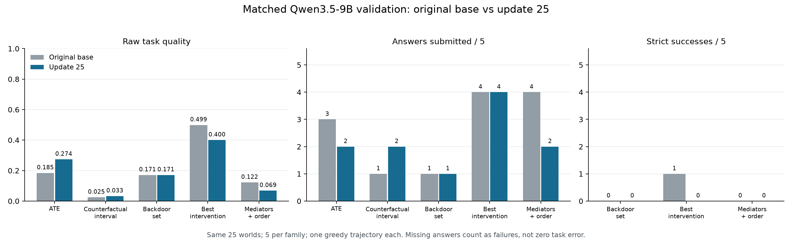

同一 Qwen3.5-9B 的基座／第 25 步验证与真实决策错误，2026-09-08

原始基座的官方 `val_only` 已完成，退出码 0；与第 25 步的 25 道题逐一配对后，没有观察到整体改善。两次均为同一 Qwen3.5-9B、相同公开输入、任务随机流、编译配置、工具与预算、一次贪心验证。全量输入和输出、环境事件及最终官方指标均已保存。当前训练已从原生第 25 步恢复，并完成第 26、27 次更新；下面的逐张量验收针对第 26 步。

| 指标 | 原始基座 | 第 25 步 |
|---|---:|---:|
| 提交答案 | 13/25 | 11/25 |
| 平均原始质量 | 0.200494 | 0.189426 |
| 生成达到响应上限 | 7/25 | 11/25 |
| 工具反馈无法放入剩余响应空间 | 5/25 | 3/25 |
| 后门调整集合法 | 0/5 | 0/5 |
| 最佳干预动作正确 | 1/5 | 0/5 |
| 中介及顺序完全正确 | 0/5 | 0/5 |

逐题原始质量有 3 题提高、5 题下降、17 题不变。两次都提交答案的有 9 题，原来提交后来未提交的有 4 题，新提交的有 2 题，两次都未提交的有 10 题。四条完整输出相同，其中三条是未完成轨迹；重复观察和耗尽响应空间在基座中已经存在，不能说是这 25 次更新才产生的问题。每类只有 5 个世界、每个世界一次生成；这既没有证明总体退化，也没有证明任务不可学。相同贪心设置也不构成 GPU 执行逐位一致保证。

真正的任务误差只在有答案时存在，不能把未完成答案填成零误差，也不能把两次各自不同的已答题子集均值当成配对变化。例如，第 20 题 ATE 在两次都完成，TV 误差从 0.0974723 降至 0.0038558；另两条新完成的反事实答案均为 `[0,1]`，没有展示比无信息区间更强的辨识能力。反事实家族没有一题在两次都完成，因此没有该家族的已完成答案误差配对均值。

四条已完成最佳干预轨迹全部检查，未挑选有利样本：

| 原数据行 | 模型动作 | 真正最优动作 | 选择损失（概率差） | 记录中的问题 |
|---|---:|---:|---:|---|
| 8 | 3 | 1 | 0.0682234 | 把只读权限猜成根节点属性，沿用首批观察最优动作 |
| 13 | 2 | 1 | 0.0971600 | 忽视已有明显干预效应，仍选观察最优动作 |
| 18 | 0 | 1 | 0.0771215 | 假定错误的因果方向并使用错误调整公式 |
| 23 | 0 | 2 | 0.1283265 | 仅做两批观察，没有执行合法干预，选择观察最优动作 |

四次动作均与各自第一批经验观察数据的最优动作相同，但不能据此说四条推理都执行同一个观察规则：第 18 题确实计算了另一条错误因果公式，其动作恰好相同。只读是操作权限；实际四个决策变量均有父节点。第 13 题已有自然样本 `NHS=0` 为 38/128，而 `do(LEO=0)` 后为 110/128，不能把模型所说“干预没有明显改变结果”当成真实实验事实。

第 18 题给出了直接针对实际轨迹的确定诊断。令 X=`LLM`、Y=`TVQ`、S=`SSD`、Z=`JET`；这里 `LLM` 是该题变量名。真实局部结构为 `SSD → JET → LLM → TVQ`，另有 `JET → TVQ`、`UUI → LLM`、`SSD → FQU`。模型却假定 `LLM → SSD → TVQ`，原文实际使用

`Σ_s P(TVQ=1 | do(SSD=s)) P(SSD=s | LLM=x)`。

按其真实采样计数代入，两个动作的值为 `[0.727464, 0.748851]`，选择 0。进一步把该公式中的每个概率替换成当前冻结世界的精确概率，仍得到 `[0.679283, 0.698451]`，仍选错 0。增加同类样本无法消除这个结构公式错误。

实际 `{JET}` 是合法后门调整集，且 Y 的父节点恰为 X、JET。正确公式

`Σ_z P(TVQ=1 | LLM=x, JET=z) P(JET=z)`

得到 `[0.7972568223, 0.7201353085]`，应该选 1；独立全联合干预枚举与冻结真值在 `1e-12` 内一致。这使用实际题的 CPT 和模型原始公式进行事后审计，没有构造极端世界，也没有把隐藏概率提供给训练或模型。

模型唯一覆盖 X、JET、Y 的实际联合批次只有 16 个样本，其 X×JET 计数为 `[[1,0,0],[14,0,1]]`。因此实际记录还不足以直接估计正确调整公式的所有条件项；这说明它的采样设计没有覆盖所需项，不能扩大为该题在总预算下理论不可辨识。原始基座在该题恰好选对，但其原文最后仍回到未经验证的观察比较，也未展示正确的 JET 调整；不能把 1→0 成功数变化描述成已经掌握的因果方法被训练破坏。

第 26 次真实更新的状态已经保全在服务器 `heldout-learning-20260908/preserved/global_step_26`：496 个有限 LoRA 张量全部较第 25 步改变，496 个 Adam 状态和调度器均为 26，992 个矩有限。生成批次从 29 变为 30，独立 CPU 调用实际官方加载方法后，后续八行 `[162,169,219,318,15,444,383,45]` 与连续 sampler 一致；只有该独立 CPU 检查里的 GPU 权重 RPC 被替代，不是另一套训练器。

真实更新日志梯度范数为 0.232421875；四条最佳干预轨迹质量为 `[1,0.5149089,0.5149089,1]`，长度惩罚均为零，存在组内差异。该步总耗时 197.78 秒，其中生成 156.43 秒、actor 更新 20.41 秒、权重同步 6.55 秒。它不是与旧首步同工作量的速度实验，也不是同题学习提高的证据。训练继续使用官方 DAPO，原来的验证期限和目标没有重置；最终 10000 次实际更新及其取消更小截断的要求仍在长期目标内。

前后基座一直是 Qwen3.5-9B。速度下降的已测原因之一是接入时显式 eager 关闭了编译／CUDA Graph；同模型、同适配器和等工作量的独立对照已显示 2.58–6.59 倍调用提速，当前训练已启用。详见 `gpu-compilation-comparison-20260908.md`。不能用模型尺寸解释变慢，亦不能用提速或有限且非零的梯度代替任务能力提高。

只读脚本和逐题结果位于 `research/heldout_learning_20260908`。`matched-base-and-native-resume-evidence.tar.gz` 包含 113 个成员、1,454,593 字节，SHA-256 为 `b74010330492c329f6dc9846abee647a43003b7a3d20bf33c45ff029c5ab32de`，保存完整前后验证、四个真实世界、诊断成功及失败日志、原生验收和训练恢复证据。完整权重留在服务器，归档保存文件哈希及数据进度。

绘图复用已有本地 Matplotlib 依赖，PNG 已目视检查；训练环境没有安装绘图包。第一次远端及默认本地绘图因缺 Matplotlib 未完成，但已写出的比较 JSON 与最终版本语义一致；键顺序和换行导致字节哈希不同，原文件没有覆盖。图、当前 JSON、原始归档及成员校验另由 `figures/manifest.json` 记录。

下一项学习证据继续来自官方后续同题验证及真实训练轨迹，重点区分实验覆盖、正确因果公式和有限上下文内完成答案。上述 25 步结果没有授权或论证调奖励、改任务比例、增加预算、注入求解程序或替换 DAPO。A/A2 的剩余认证、C/D 的生成与预算义务保持未完成。
