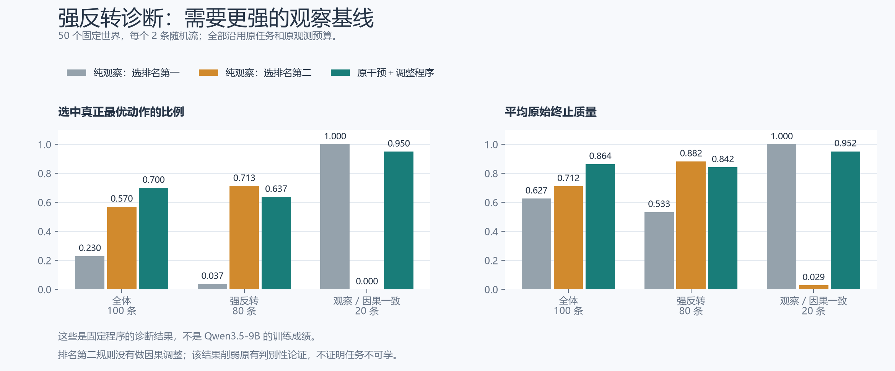
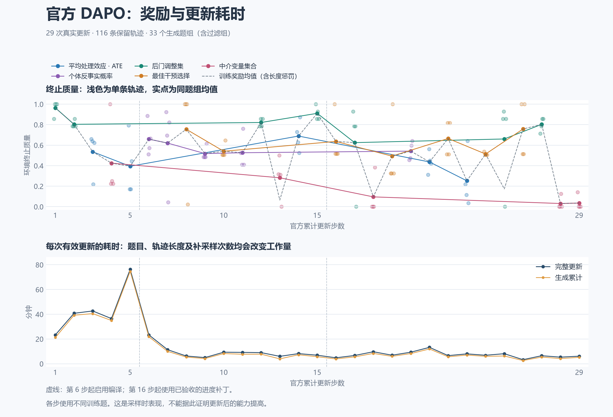
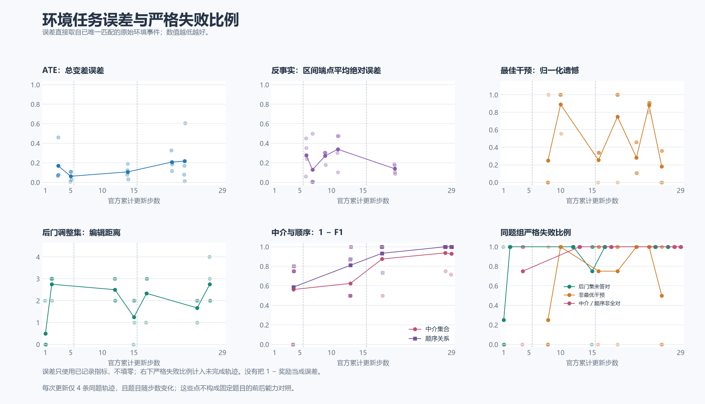

强反转生成偏差与实际训练信号，2026-09-08

需要更正原有能力判别性结论。复用原 50 个诊断世界、每世界两条随机流，只做自然观察后选“观察排名第二”，可答对 57/100；在强反转部分答对 57/80，超过原干预调整程序的本批计数 51/80。因此，原先仅用 63.75% 对 3.75% 支持强反转任务上的因果方法收益，证据不充分。这没有证明任务不可学，也没有证明这两个程序在整个生成分布上的优劣。

| 固定程序 | 全部 100 条正确数 | 强反转 80 条正确数 | 一致 20 条正确数 | 强反转平均质量 |
|---|---:|---:|---:|---:|
| 纯观察，选择观察最优 | 23 | 3 | 20 | 0.533344 |
| 纯观察，选择观察排名第二 | 57 | 57 | 0 | 0.882283 |
| 原干预筛选＋调整程序 | 70 | 51 | 19 | 0.842266 |

这里“排名第二”按公开目标排序：最小化时选第二小，最大化时选第二大；并列按公开状态编号确定。规则只读取公开目标、状态域和自然观察频数，没有使用图、CPT、真值或干预反馈。它不是“始终选观察最差”：后者在当前 100 道训练干预题的总体概率诊断中只对 19 道，而选第二名对 52 道。两者应明确区分。

重放沿用原世界、`finite-budget-audit:{seed_id}:{replicate}` 随机流标识、原采样分段和全额标量预算。100 条轨迹的 300 个历史检查点答案全部复现，所有新答案经生产环境／评分器提交。旧诊断与当前的七个环境、随机流、真值及评分源文件哈希相同，NumPy 版本也相同；没有重新生成题目或修改 CPT。新记录保存每批命令、完整反馈、累计计数和评分。第一次尝试仅在输出有理数诊断字段时序列化失败，第二版完整完成；失败日志一并保留。

另用原主动程序最后收集的同一批自然观察数据计算排名第二，得到全体 53/100、强反转 53/80；原取第一名规则为 25/100、5/80。这个结果只解释固定样本上的规则差异，因为主动程序先前的实验决定了观测集合及样本数。上表的纯观察重放单独消除了这一采样设计依赖。

原程序对排名第二的全体净优势为 13 条：34 条只有原程序正确、21 条只有排名第二正确。在强反转部分，15 条只有原程序正确、21 条只有排名第二正确；其余 36 条都对、8 条都错。100 条来自 50 个世界，不是 100 个独立世界；规则是在分析中提出的，不能把这些计数当成经过选择校正的显著性结论。原程序整体仍有较高成绩，但其优势主要来自一致部分，不能继续把旧的 47／60 个百分点差距全部解释为因果能力证据。

根因位于接受事件，能从当前实现直接说明。记 `o_a=P(Y=y|X=a)`、`v_a=P(Y=y|do(X=a))`，O、C 分别是观察和因果的最优动作集合。`world_space.py` 的 `_best_intervention_relation_from_causal_values` 和 `_best_intervention_proposal_is_admitted` 要求强反转任务满足

`O ∩ C = ∅`，且 O 中最好的因果值相对真正最优值的损失至少为 `2/sqrt(2048)`。

因此在这个被条件筛选的集合里，“用精确观察条件概率选最优”必错，这是接受事件本身的性质。比它好不自动证明用了有效因果方法。接受条件没有限制 C 在观察排序中的位置，也没有保证它与观察最优值有足够大的观察概率间隔。在随机提案模型下，完整世界、角色和状态的分布被该接受事件条件化；保持同一分布的等价计算优化不能消除由此产生的排名偏好。

当前提交的 100 道训练干预题中，真正最优动作处于观察排名第一／第二／第三／第四的数量为 20／52／17／11。80 道强反转题中有 52 道位于第二名。五道验证题对应数量为 1／3／1／0。它们是这些冻结题的精确统计，不是整个生成分布的概率估计，也不是可执行有限样本策略的成绩。

第 26 步的实际训练题 93 是这个缺口的具体见证：目标最小化 `P(PUH=1|do(QFT=d))`，动作 0 与 2 的观察值分别为 0.4685993、0.4671312，只差 0.0014681；因果值分别为 0.5488223、0.6837894，错选 2 的损失为 0.1349671。该题符合强反转定义，但有限样本观察比较完全可能选中正确的 0。实际答对轨迹的 900 个自然样本计数正是 `[251/536,52/95,50/94,145/175]`，选中 0；这些最终汇总与原始反馈一致，不能归因于加法错误。

一个直接的误差关系也说明两种间隔不可混用。若最小化目标中 `||o_hat-o||∞≤ε`，按估计观察值选中的动作 a 满足 `o_a-min(o)≤2ε`。生成器对 v 上的损失下界不提供 o 上这个间隔的下界。该关系说明现有接受谓词缺少什么保证；本轮没有据此添加经验阈值或新的筛选条件。

实际训练信号已按完整四份冻结快照重新核对。第 1–29 次更新共 116 条保留轨迹、33 个生成题组，过滤四组对应原训练行 `[478,496,324,352]`；它们由实际官方 sampler 的前 33 行和完整保留记录核对得到。没有证据支持“大部分有效样本被过滤”。直接调用固定官方 `compute_grpo_outcome_advantage` 的 CPU 标量路径，结果如下：

| 家族 | 保留题组 | 轨迹数 | 正优势轨迹 | 严格正确且正优势 |
|---|---:|---:|---:|---:|
| 后门调整集 | 7 | 28 | 15 | 4 |
| ATE | 5 | 20 | 10 | 不定义二值阈值 |
| 中介及顺序 | 5 | 20 | 6 | 1 |
| 反事实区间 | 5 | 20 | 9 | 不定义二值阈值 |
| 最佳干预 | 7 | 28 | 11 | 7 |

正优势表示同组相对信号，并不保证一次共享参数更新后每条对应轨迹的概率都增加。部分正确答案获得正优势也不是 DAPO 实现错误。本检查没有重放 GPU 梯度，更没有替换官方算法、损失或奖励。

六组强反转训练题的 24 条保留轨迹只有四条选对动作。四条全部抽出检查，最终记录都使用未经调整的观察条件概率：

| 更新／原训练行 | 成功合法干预数 | 最终记录中的决策依据 |
|---|---:|---|
| 16／433 | 33 | 最后三批 192 个自然样本的观察比较；未展示有效因果调整 |
| 19／33 | 0 | 后两批自然观察，假定无隐藏混杂意味着可直接用观察条件概率 |
| 26／93，第一条 | 0 | 最近 128 个自然样本；曾尝试只读目标，被协议拒绝 |
| 26／93，第二条 | 0 | 900 个自然样本的观察比较 |

不要求每道因果题都必须做干预：正确后门调整也可以利用观察数据。这里的问题是原文未展示这种调整，且冻结世界的精确观察最优动作均与正确动作不同。这些正确终局不能充当已发现正确因果解法的证据。

终局奖励对此有明确的能力边界：同一世界中，两条无长度惩罚的轨迹若提交同一动作，就获得同一环境质量；评分器没有读取其推理是否正确。因此，官方 DAPO 执行正确，不等于终局奖励能够逐条认证因果方法。需要通过任务分布中的泛化表现和更强基线建立能力证据，不能以干预次数、文字表态、非零梯度或吞吐代替。

图表复用现有可视化脚本，冻结到第 29 步，PNG 已目视检查，并保存 SVG／PDF。题目随步数改变，这些曲线不是同题学习增益。上一轮原始基座与第 25 步的同题对照仍未显示整体改善；训练保持运行，本轮没有修改生成器、任务比例、预算、提示、奖励或官方 DAPO。

归档 `research/training_signal_20260908/training-signal-and-rank-evidence.tar.gz` 包含 119 个成员、2,050,187 字节，SHA-256 为 `7d60b9e9ae90737baa053cb787b9d69856ea4cc38c4dd6cf5b4199932e657e34`。它保存全部训练快照、四条成功轨迹、纯观察重放、失败记录和运行时来源；原始 50 世界归档由已有仓库哈希引用。

下一项归回 C/D/E：明确强反转条件改变了哪些可被非因果规则利用的联合分布信息，并用后续官方同题验证检查实际策略是否超过这些基线。不能靠强制排名配额、调低反转阈值或提高干预次数奖励掩盖问题。当前证据不足以确定一个应改变到的自然生成律，故尚无已证明合理的生成器修改；A/A2 的剩余认证与最终 10000 次实际更新等完整目标继续保留。
