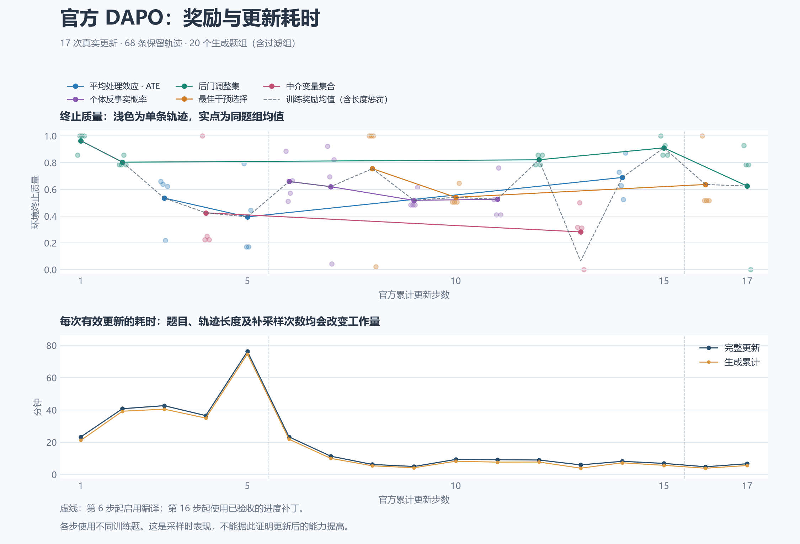
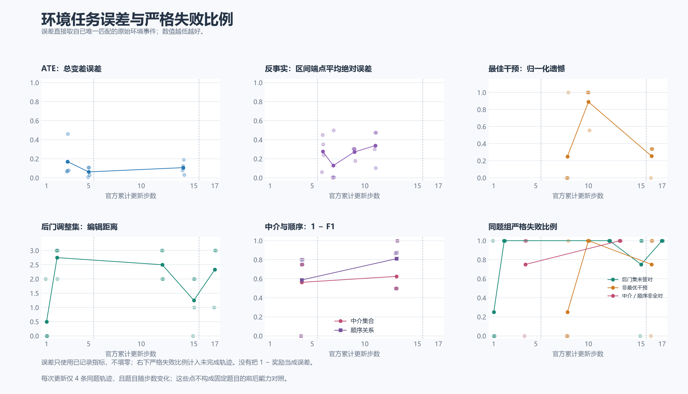

Qwen3.5-9B 官方训练：实际恢复验收与可信曲线，2026-09-08

新旧模型型号都是 Qwen3.5-9B，模型规模不能解释减速。已经验证的主要效率损失是此前显式 eager 关闭编译与 CUDA Graph：固定同一模型、非零 LoRA、输入及输出长度后，开启编译使八种生成条件快 2.58–6.59 倍，详见 [真实 GPU 对照](gpu-compilation-comparison-20260908.md)。当前官方训练已经使用编译配置。历史不同任务、不同适配器的整步时间不能全部按该倍数解释。

真实恢复与第 16 次更新

旧编译运行在完整保全 `global_step_15` 后按核对的 PID／创建时间停止；新运行从其原生 LoRA、Adam、训练侧 RNG、调度器和数据状态恢复，未重新初始化。入口仍为官方 `dapo.main_dapo`，显式使用已验证的 `progress-v1` 来源。进度补丁不改变奖励、动态过滤、GRPO 优势、动作掩码、token 聚合、Token-TIS 或优化器公式。其控制流根因、计数不变量和 CPU 对照见 [进度修复](dapo-progress-correctness-20260908.md)。

| 第 16 次实际更新 | 记录 |
|---|---:|
| 完整一步 | 289.276 秒（4.82 分钟） |
| 生成 | 234.598 秒 |
| actor 更新 | 30.433 秒 |
| 权重同步 | 6.709 秒 |
| 梯度范数 | 0.140625 |
| Token-TIS 均值 | 1.00019455 |
| TIS 有效样本比例 | 0.99936276 |
| TIS 高／低端裁剪比例 | 均为 0 |
| 本步生成题组 | 1 |

完整保存的第 16 步原生文件中，496 个 BF16 LoRA 张量均有限，且全部较第 15 步改变；496 个 Adam 状态的步数均为 16，992 个矩有限，调度器计数为 16。`dapo_progress.json` 实际记录 `completed_updates=16, generated_batches=19, data_epoch=0, batches_per_epoch=500`，`data.pt` 游标也是 19；上一检查点的生成游标为 18。

另外在隐藏 CUDA 的 CPU 进程中调用实际候选 `_load_checkpoint` 方法，只有 GPU 权重加载 RPC 被显式替代。它恢复 U/G/e 为 16/19/0，后续八行 `[142,489,33,291,352,335,413,295]` 与不间断 sampler 相同。这与真实训练日志中已经执行的 GPU 加载／更新是两类证据：没有声称恢复的 GPU 内存逐位一致，也没有以首轮内恢复证明真实 GPU 跨轮次运行已经验收。跨轮次及耗尽状态由此前 15 个实际官方方法的 CPU 控制用例覆盖。

新运行目录为 `/home/chen/runs/dapo-progress-20260908/resume-progress-01`，主进程 PID 为 400557、创建时间为 1788815230.7；第 16 步原生副本位于其中的 `verified-update16/global_step_16`。归档时同一进程仍在运行，最新发布标记为 20。曲线固定覆盖已冻结的前 17 步，不把标记为 20 的观察当作第 20 步张量已完成同等验收。

曲线与真实任务信号

三个冻结快照覆盖连续 1–17 次更新、68 条保留轨迹、20 个生成题组（含被动态过滤的组）。每条保留输出按完整执行命令序列与原始环境事件唯一匹配。绘图复用原脚本样式，未平滑；灰虚线是官方实际训练奖励均值，彩色是原始环境质量。

| 任务 | 保留轨迹 | 原始质量均值 | 严格成功数 |
|---|---:|---:|---:|
| 后门调整集 | 20 | 0.825000 | 合法 4/20 |
| ATE | 12 | 0.539771 | 以 TV 误差展示，不另造成功阈值 |
| 中介及顺序 | 8 | 0.353646 | 两项全对 1/8 |
| 反事实概率区间 | 16 | 0.581096 | 以端点平均绝对误差展示 |
| 最佳干预 | 12 | 0.644382 | 最优动作 4/12 |

后门的高平均质量与低合法率同时存在：奖励给予接近合法集的答案部分分数，不能把 0.825 解释为 82.5% 答对率。第 17 步一条保留轨迹没有完成答案，原始质量为零、无任务误差指标；严格失败分母包含它，编辑距离仅有 19 条记录，缺失值不填零。快照中其它仍在执行、未进入已完成更新的轨迹不加入这些分母。

第 13 步还有一条已完成中介轨迹：原始质量 0.5，官方长度惩罚 −0.86962890625，实际训练奖励 −0.36962890625。该题组原始质量均值为 0.282291667，shaping 后为 0.064884440，与官方日志 0.064884439 在浮点容差内一致。固定上游 reward manager 按 response 的 attention 长度计算该惩罚，包含工具文本；它与仅模型动作 token 的损失掩码口径不同。本轮保留标准公式并据实区分两个数值，没有把单条长度惩罚升级为训练失败的主要原因。

只读轨迹分析器的一处修正也已验收：模型曾发出不合法 JSON 字符串 `{"type":"observ`，环境将其作为原始字符串记录并返回协议错误，模型随后继续解题。旧分析器因此丢掉整条命令序列，新版保留该原始字符串，以全部 25 次命令唯一匹配；39 条已有匹配及全部官方指标保持原样，新增一条原先未解析的匹配。没有按奖励或输出行号猜测轨迹，也没有改运行中的环境或训练。

这些图表示不同题目上的训练采样表现，不能证明更新前后在同题／留出集上的能力提高。当前运行继续按原验证配置执行：目标 500 次实际更新，原 24 小时截止时间 1788880085.4616497 保留，验证频率每 25 步；没有因恢复重新获得 24 小时。它不冒充用户要求的最终 10,000 步训练。剩余问题完成后，最终运行必须显式选择已验收的进度来源，设置 10,000 次官方实际更新，不另加较小步数或墙钟截断；完整长期目标保持未完成。

原始证据及复现

`research/dapo_progress_20260908/gpu-update16-and-curves-evidence.tar.gz` 共 79 个成员、967,020 字节，SHA-256 为 `868ff881acadd334e8585724d84424c0f3983793b9e6f65e75da2726cdbf2361`。它包含实际加载／更新日志、切换身份及配置、第 15／16 步验收与真实 sampler 状态、全部曲线输入和环境事件、分析器修正前后的记录。大模型／优化器张量保存在服务器，归档记录其哈希。每个成员的哈希见同名 `.sha256.json`。

使用归档内 `curve-inputs/eager-1-5.json`、`compiled-6-15.json`、`progress-16-17.json` 作为 `plot_trusted_progress.py --inputs` 的三个参数，另设 `--output` 即可重画。脚本检查连续更新编号、唯一轨迹、逐步 shaped reward 与官方均值一致，以及累计生成计数；`figures/manifest.json` 记录输入、绘图脚本、原样式和全部输出文件的哈希。
